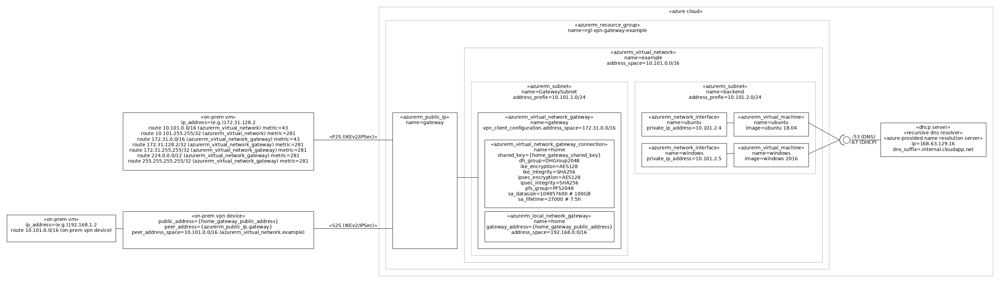

an example azure vpn gateway




# Usage (on a Ubuntu Desktop or builder environment)

Install the tools (or launch and enter the builder environment):

```bash
# install the tools.
./provision-tools.sh
# OR launch the builder environment and use the tools inside it.
time vagrant up builder
vagrant ssh
cd /vagrant
```

Login into azure-cli:

```bash
az login
```

List the subscriptions and select the current one if the default is not OK:

```bash
az account list
az account set --subscription=<id>
az account show
```

Review `main.tf` and maybe change the `location` variable.

Initialize terraform:

```bash
make terraform-init
```

Launch the example:

**NB** creating a VPN gateway takes more than 30m.

```bash
make terraform-apply
```

Show the point-to-site (p2s) vpn client gateway information:

```bash
make show-p2s-vpn-client-configuration
```

You should see something alike:

```
VPN Server: azuregateway-2a981a19-184e-4351-bc0d-bb8a222bd8d9-5919c114fd46.vpn.azure.com
VPN Server CA Certificate:
    Data:
        Version: 3 (0x2)
        Serial Number:
            08:3b:e0:56:90:42:46:b1:a1:75:6a:c9:59:91:c7:4a
    Signature Algorithm: sha1WithRSAEncryption
        Issuer: C = US, O = DigiCert Inc, OU = www.digicert.com, CN = DigiCert Global Root CA
        Validity
            Not Before: Nov 10 00:00:00 2006 GMT
            Not After : Nov 10 00:00:00 2031 GMT
        Subject: C = US, O = DigiCert Inc, OU = www.digicert.com, CN = DigiCert Global Root CA
...
```

In your host, build and install the [base Windows box](https://github.com/rgl/windows-2016-vagrant).

Start a local test VM:

```bash
time vagrant up windows-p2s-vpn-client
```

Login into the local test VM.

Open an PowerShell session, and install the VPN client:

```powershell
C:\Users\vagrant\Desktop\vpn-client\WindowsAmd64\VpnClientSetupAmd64.exe
```

Manually start the `example` VPN connection.

Check the created VPN virtual interface:

```powershell
Get-NetIPConfiguration -InterfaceAlias Example
```

Check the routing table:

```powershell
route print >"$env:USERPROFILE\Desktop\ip-routes-example.txt"
Compare-Object (Get-Content "$env:USERPROFILE\Desktop\ip-routes-original.txt") (Get-Content "$env:USERPROFILE\Desktop\ip-routes-example.txt")
```

Start an SSH connection to the ubuntu virtual machine:

```powershell
putty "rgl@$(Get-Content -Raw C:\vagrant\shared\ubuntu_ip_address.txt)"
```

Start an RDP connection to the windows virtual machine:

```powershell
mstsc `
    "/v:$((Get-Content -Raw C:\vagrant\shared\windows_ip_address.txt).Trim())" `
    /w:800 `
    /h:600
```

**NB** The default username is `rgl` and password is `HeyH0Password`.

# Reference

* https://docs.microsoft.com/en-us/azure/vpn-gateway/vpn-gateway-about-vpngateways
* https://docs.microsoft.com/en-us/azure/vpn-gateway/vpn-gateway-vpn-faq
* https://docs.microsoft.com/en-us/azure/vpn-gateway/vpn-gateway-about-point-to-site-routing
* https://docs.microsoft.com/en-us/azure/vpn-gateway/vpn-gateway-howto-site-to-site-resource-manager-cli
* https://docs.microsoft.com/en-us/azure/vpn-gateway/vpn-gateway-about-vpn-devices#ipsec
* https://docs.microsoft.com/en-us/azure/vpn-gateway/vpn-gateway-ipsecikepolicy-rm-powershell
